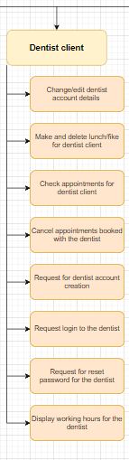

# Dentist Client

## **Name**
Dentistimo

## **Description**
an interactive GUI that permits dentists to easily see what they're working hours are, and to access information on clients who have made an appointment with them. It also gives the dentist the ability to cancel any appointments with them for unforeseen reasons. 
dentists will also have the ability to control when they want to have their breaks. They can decide what time they want to have their lunch and fika breaks, and they can also remove those breaks if they so choose 
dentists also have the ability to change the first name, last name, email address, and password that they have signed up with the account.
the point of this GUI is to allow dentist to easily and quickly be aware of their working schedule and control their break time. As well as pulling up relative information about what appointments I have that day or the foreseeable future
## **Visuals**
component dentist client of the functional decomposition diagram

homepage

login page

register page

reset page

user profile page

appointment page

## **Installation** 
To run Dentistimos dentist-client component you need to do the following steps:

Clone the repository on to your device.   
Open a terminal and navigate to the client folder, where you will first type "npm install" which will install the neccesary dependencies.   
When the installation is complete you will type "npm run serve". Copy the adress into web browser of your choice.   
Create an account and enjoy all features of a dentist!
## **Technologies**
*Vue*

*NodeJS*

*MQTTX*

*MQTT*
## **Usage**
permit dentist easy usage of the system to access what appointments they have, to cancel appointments they have with their user clients and control when their breaks take place. 
Furthermore, the system permits them to know when their working hours are going to be, and easily change their account information like first name, last name, email address, and password

## **Authors and acknowledgment**
Liam Jason Axelrod 
Adrian Niklasson
## **License**
MIT License

Copyright (c) 2022 Liam Jason Axelrod and Adrian Niklasson

Permission is hereby granted, free of charge, to any person obtaining a copy
of this software and associated documentation files (the "Software"), to deal
in the Software without restriction, including without limitation the rights
to use, copy, modify, merge, publish, distribute, sublicense, and/or sell
copies of the Software, and to permit persons to whom the Software is
furnished to do so, subject to the following conditions:

The above copyright notice and this permission notice shall be included in all
copies or substantial portions of the Software.

THE SOFTWARE IS PROVIDED "AS IS", WITHOUT WARRANTY OF ANY KIND, EXPRESS OR
IMPLIED, INCLUDING BUT NOT LIMITED TO THE WARRANTIES OF MERCHANTABILITY,
FITNESS FOR A PARTICULAR PURPOSE AND NONINFRINGEMENT. IN NO EVENT SHALL THE
AUTHORS OR COPYRIGHT HOLDERS BE LIABLE FOR ANY CLAIM, DAMAGES OR OTHER
LIABILITY, WHETHER IN AN ACTION OF CONTRACT, TORT OR OTHERWISE, ARISING FROM,
OUT OF OR IN CONNECTION WITH THE SOFTWARE OR THE USE OR OTHER DEALINGS IN THE
SOFTWARE.
